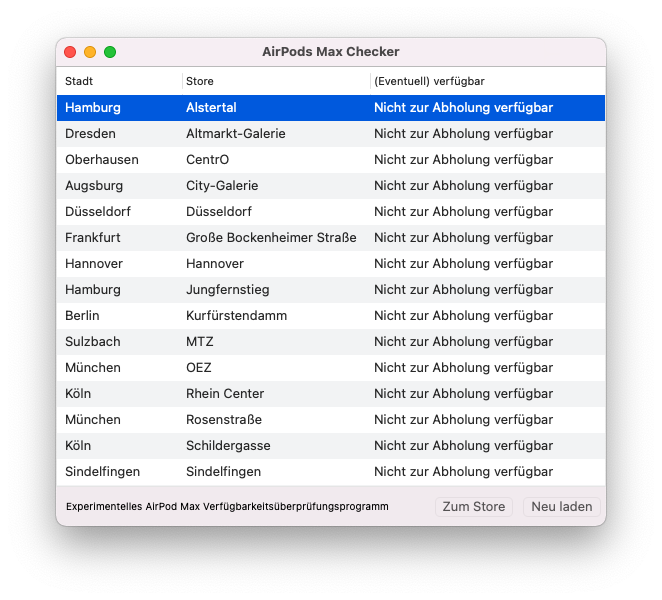

# swift-macos-airpod-availability-checker
Simple macOS Swift app to check the availability of **AirPods Pros** in the German Apple retail store locations. Nevertheless the app is neither final nor more than a little gimmick :).

## Install
1. Clone the repo `https://github.com/tscholze/swift-macos-airpod-availability-checker.git`
2. Go into the app's directory `cd swift-macos-airpod-availability-checker`
4. Open `AirPods Pro Checker.xcodeproj`
5. Run it

## How it looks

	

## License
The app is licensed under [MIT](https://en.wikipedia.org/wiki/MIT_License) License.
