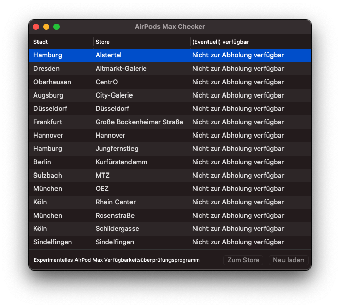

# swift-macos-airpod-availability-checker

")

This is a simple macOS Swift app to check the availability of **AirPods Pros** in the German Apple retail store locations. 

Nevertheless the app is neither final nor more than a little gimmick :). But it's happy coding time!

#communityrocks

## Install
1. Clone the repo `https://github.com/tscholze/swift-macos-airpod-availability-checker.git`
2. Go into the app's directory `cd swift-macos-airpod-availability-checker`
4. Open `AirPods Pro Checker.xcodeproj`
5. Run it

## How it looks

	

## Media coverage
### Version 1
The app had a minor media coverage with articles in the German speaking [Apfeltalk magazin](https://www.apfeltalk.de/magazin/news/airpods-verfuegbarkeit/) and the also German speaking computer magazin [Computerbild](https://www.computerbild.de/artikel/cb-News-Internet-AirPods-ausverkauft-trotzdem-kaufen-18116593.html).

## Thanks to
- Jesper Frommherz - Icon creator ([#neverforgetjesper](https://twitter.com/hashtag/neverforgetjesper))
- Michael Reimann - Geschäftsführer [Apfeltalk](https://apfeltalk.de)

## License
The app is licensed under [MIT](https://en.wikipedia.org/wiki/MIT_License) License.